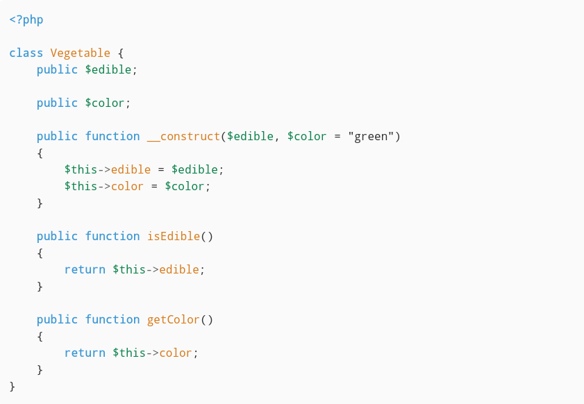

# Highlighter

A teeny-tiny PHP syntax highlighter. Uses `token_get_all()` to convert the PHP code you provide into PHP language tokens, and then renders those tokens into HTML using either the default styles or the ones you set.

For example, the following PHP:
```php
<?php

class Vegetable {
    public $edible;

    public $color;

    public function __construct($edible, $color = "green")
    {
        $this->edible = $edible;
        $this->color = $color;
    }

    public function isEdible()
    {
        return $this->edible;
    }

    public function getColor()
    {
        return $this->color;
    }
}
```

will result in the following HTML:
```html
<pre><code><span style="color: #3A97D4; font-weight: bold;">&lt;?php
</span><span style="color: #09814A; font-weight: bold;">
</span><span style="color: #3A97D4; font-weight: bold;">class</span><span style="color: #09814A; font-weight: bold;"> </span><span style="color: #D87A1A">Vegetable</span><span style="color: #09814A; font-weight: bold;"> </span><span style="color: #333;">{</span><span style="color: #09814A; font-weight: bold;">
    </span><span style="color: #3A97D4; font-weight: bold;">public</span><span style="color: #09814A; font-weight: bold;"> </span><span style="color: #09814A">$edible</span><span style="color: #333;">;</span><span style="color: #09814A; font-weight: bold;">

    </span><span style="color: #3A97D4; font-weight: bold;">public</span><span style="color: #09814A; font-weight: bold;"> </span><span style="color: #09814A">$color</span><span style="color: #333;">;</span><span style="color: #09814A; font-weight: bold;">

    </span><span style="color: #3A97D4; font-weight: bold;">public</span><span style="color: #09814A; font-weight: bold;"> </span><span style="color: #3A97D4; font-weight: bold;">function</span><span style="color: #09814A; font-weight: bold;"> </span><span style="color: #D87A1A">__construct</span><span style="color: #333;">(</span><span style="color: #09814A">$edible</span><span style="color: #333;">,</span><span style="color: #09814A; font-weight: bold;"> </span><span style="color: #09814A">$color</span><span style="color: #09814A; font-weight: bold;"> </span><span style="color: #333;">=</span><span style="color: #09814A; font-weight: bold;"> </span><span style="color: #333">&quot;green&quot;</span><span style="color: #333;">)</span><span style="color: #09814A; font-weight: bold;">
    </span><span style="color: #333;">{</span><span style="color: #09814A; font-weight: bold;">
        </span><span style="color: #09814A">$this</span><span style="color: #666">-&gt;</span><span style="color: #D87A1A">edible</span><span style="color: #09814A; font-weight: bold;"> </span><span style="color: #333;">=</span><span style="color: #09814A; font-weight: bold;"> </span><span style="color: #09814A">$edible</span><span style="color: #333;">;</span><span style="color: #09814A; font-weight: bold;">
        </span><span style="color: #09814A">$this</span><span style="color: #666">-&gt;</span><span style="color: #D87A1A">color</span><span style="color: #09814A; font-weight: bold;"> </span><span style="color: #333;">=</span><span style="color: #09814A; font-weight: bold;"> </span><span style="color: #09814A">$color</span><span style="color: #333;">;</span><span style="color: #09814A; font-weight: bold;">
    </span><span style="color: #333;">}</span><span style="color: #09814A; font-weight: bold;">

    </span><span style="color: #3A97D4; font-weight: bold;">public</span><span style="color: #09814A; font-weight: bold;"> </span><span style="color: #3A97D4; font-weight: bold;">function</span><span style="color: #09814A; font-weight: bold;"> </span><span style="color: #D87A1A">isEdible</span><span style="color: #333;">(</span><span style="color: #333;">)</span><span style="color: #09814A; font-weight: bold;">
    </span><span style="color: #333;">{</span><span style="color: #09814A; font-weight: bold;">
        </span><span style="color: #3A97D4; font-weight: bold;">return</span><span style="color: #09814A; font-weight: bold;"> </span><span style="color: #09814A">$this</span><span style="color: #666">-&gt;</span><span style="color: #D87A1A">edible</span><span style="color: #333;">;</span><span style="color: #09814A; font-weight: bold;">
    </span><span style="color: #333;">}</span><span style="color: #09814A; font-weight: bold;">

    </span><span style="color: #3A97D4; font-weight: bold;">public</span><span style="color: #09814A; font-weight: bold;"> </span><span style="color: #3A97D4; font-weight: bold;">function</span><span style="color: #09814A; font-weight: bold;"> </span><span style="color: #D87A1A">getColor</span><span style="color: #333;">(</span><span style="color: #333;">)</span><span style="color: #09814A; font-weight: bold;">
    </span><span style="color: #333;">{</span><span style="color: #09814A; font-weight: bold;">
        </span><span style="color: #3A97D4; font-weight: bold;">return</span><span style="color: #09814A; font-weight: bold;"> </span><span style="color: #09814A">$this</span><span style="color: #666">-&gt;</span><span style="color: #D87A1A">color</span><span style="color: #333;">;</span><span style="color: #09814A; font-weight: bold;">
    </span><span style="color: #333;">}</span><span style="color: #09814A; font-weight: bold;">
</span><span style="color: #333;">}</span></code></pre>
```

which will look a little something like this, when rendered in a browser:

